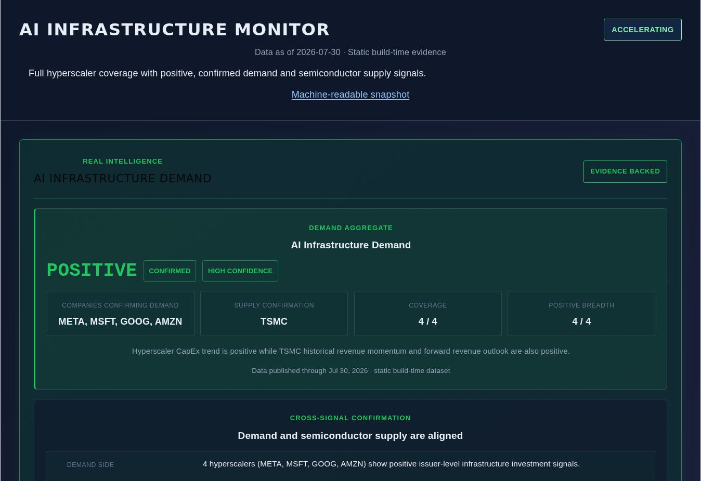

# AI Infrastructure Monitor

NVIDIA and hyperscalers show demand. This project checks official filings
and a fixed public-project cohort to see whether infrastructure is actually
being built — without treating total CapEx as AI CapEx.

**Live:** [Open the dashboard](https://jimisu.github.io/ai-infrastructure-monitor/)

**Snapshot:** [latest.json](https://jimisu.github.io/ai-infrastructure-monitor/latest.json)

Not investment advice. Issuer CapEx is not AI-only CapEx.



*Production screenshot captured September 5, 2026, after the v1.0 presentation deployment.*

## Current board

- Status: see the live page / `latest.json` for `ACCELERATING`, `STABLE`, `WEAKENING`, or `INCOMPLETE`.
- Evidence: META, MSFT, GOOG, AMZN official CapEx or PPE + TSMC revenue/outlook.
- Data is static at build time and may include explicitly retained manual facts.
- The board describes monitored financial-demand signals; the Q3 cohort does not establish a global buildout rate.

## This quarter

[2026 Q3 AI Build Reality Check](docs/research/ai-infrastructure-observability/productization/2026-q3-ai-build-reality-check-draft.md):

> Demand is strong. Physical execution is real but uneven.

Coverage: 15 deliberately selected public known cases, not a representative market sample.
At the August 30, 2026 evidence cutoff, 7 were operating, 7 were under construction or
development, and 1 was contracted without supported construction evidence. The dashboard
summarizes Michigan, Sakai, and Rainier with their source links and limitations.

## Run locally

```bash
npm ci && npm run dev
npm run verify:agent
```

`verify:agent` runs lint, build, presentation tests, ingestion tests, and five downstream verifiers.
It does not run live ingestion or promote production data.

```bash
npm run build
npm run preview
```

Each build generates `public/latest.json` and `dist/latest.json` from the same module-scope
snapshot used by the UI. Run `npm run build` before `npm run dev` after changing approved input
code or data so the development snapshot is refreshed. `asOf` is the latest selected evidence
publication date, not the build time. `confidence` preserves the hyperscaler aggregate's existing
confidence; it is not a new confidence score for the board or project cohort.

Pages deployment remains manual (`workflow_dispatch` on `main`); pushing or merging does not deploy.

## What this is not

Investment advice, a global capacity estimate, or AI-only CapEx. Facility and utility power are
not AI IT load. Different accelerator generations and campus/phase scopes are not added together.

## Maintainers

- [Agent rules](AGENTS.md)
- [Architecture map](docs/architecture/README.md)
- [Research index](docs/research/ai-infrastructure-observability/README.md)
- [Contributing](CONTRIBUTING.md)

## License and data rights

Original source code and original project documentation are licensed under the
[MIT License](LICENSE) unless a file states otherwise.

Third-party source documents, issuer and regulatory disclosures, quotations, trademarks, adapted
source-shape fixtures, and other externally sourced materials are excluded from the MIT License and
remain subject to their original rights and terms. Structured observations, provenance records, and
compiled research data are not licensed for redistribution unless explicitly stated otherwise.

See [NOTICE.md](NOTICE.md) for the complete license scope, data-rights boundary, source-material
treatment, and attribution terms.

## Research-use disclaimer

This project is provided for research, educational, and evidence-tracking purposes only. It does not
provide investment, financial, legal, tax, accounting, or other professional advice and does not
recommend buying, selling, or holding any security.

Evidence and derived outputs may be incomplete, delayed, revised, unavailable, or incorrect. Verify
material conclusions against the linked original source and current document version before relying
on them.
