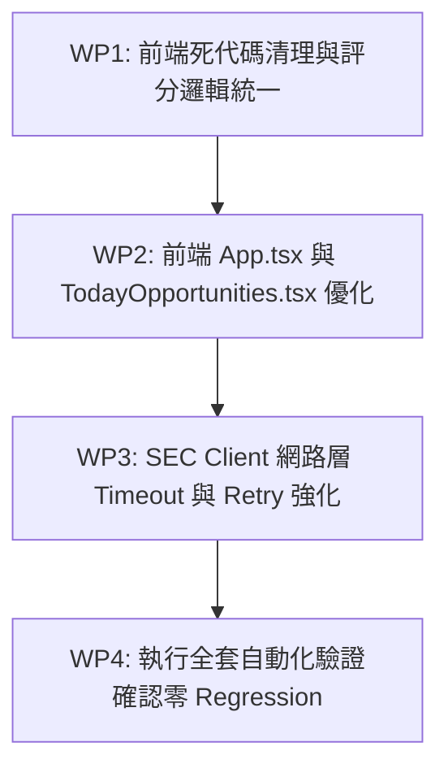

# Code Review & Refactoring Recommendations for AI Infrastructure Monitor

> **Document Status**: Complete Code Review & Handoff Specification  
> **Target Audience**: Next Engineer / Claude Agent  
> **Review Date**: 2026-08-21  
> **Baseline Commit**: `1d360c2` (`main`)  
> **Active Branch**: `review/code-analysis-and-recommendations` (Clean branch, no source/doc changes)  
> **Current Verification Status**: `npm run verify:agent` passing (155 tests pass, build & lint clean)

---

## 1. Executive Summary & Repository Authority (重要事實與邊界)

### 1.1 專案真實定位與因果鏈 (The AI Infrastructure Transmission Chain)
本專案**並非**系統級 DevOps/SRE 運維監控（如伺服器 CPU/GPU 利用率、K8s 節點狀態、Ping 延遲），而是 **AI 基礎設施資本支出意圖與全球硬體供應鏈傳遞鏈監控（AI Infrastructure Supply Chain & Capital Intent Monitor）**。

根據 [`AGENTS.md`](../AGENTS.md) 與 [`docs/architecture/README.md`](architecture/README.md)，本系統追蹤的嚴格傳遞鏈為：
$$\text{算力需求} \longrightarrow \text{超大規模雲端商資本支出意圖} \longrightarrow \text{實體基礎設施建設承諾} \longrightarrow \text{積壓訂單/訂單} \longrightarrow \text{實際部署} \longrightarrow \text{半導體供應端驗證}$$

### 1.2 不可動搖的資料原則 (Non-negotiable Guardrails)
在進行任何後續重構或實作時，必須嚴格遵守以下規則：
1. **[R3-R8] 官方 Tier-1 來源與 Fail-Closed**：只採用官方 SEC 申報（6-K, 8-K, 10-Q/K）與 IR 財報。遇任何異常或模糊欄位必須 Fail-Closed，絕不猜測、補全或外推財務數據。
2. **[R8a] 嚴禁定性數據轉為數值**：禁止將質化評論編碼為數值型 `MetricObservation`。
3. **[P1-P4] 保護區**：未獲明確授權，**嚴禁修改或 Promote 生產 Canonical 資料庫**（`data/ingestion/`），嚴禁修改訊號規則閾值（`src/config/signalRules.ts`）或評分權重。
4. **真實數據 vs Demo 數據邊界**：
   - **Real Intelligence**：來自 Canonical 數據庫的 TSMC 月營收年增率、四大巨頭 CapEx 廣度與交叉確認訊號。
   - **Demo Model**：AISS、10X Score、Opportunity Score、Market Regime 等展示層評分模型，不得混淆為客觀事實。

---

## 2. 系統架構與資料流向圖 (System Architecture & Data Flow)

```
[ Tier-1 Official Sources (SEC EDGAR, IR Portals) ]
                      │
                      ▼
[ Ingestion Layer (scripts/ingestion/) ]
  ├── sec-client.mjs (SEC EDGAR API 呼叫)
  ├── snapshot-store.mjs (SHA-256 不可變快照儲存)
  ├── Semantic Parsers (tsm-sec-lib, meta-guidance-lib, goog, msft, amzn)
  └── canonical-store.mjs (標準化資料 Promoting: ACTIVE / SUPERSEDED)
                      │
                      ▼
[ Data Provider Layer (src/data/) ]
  ├── Validated Observation Providers (TSM, META, GOOG, MSFT, AMZN)
  ├── Source Registries (sources.ts, capexDefinitionRegistry.ts)
  └── Parity Verification (比對 Manual Baseline 與 Ingested Canonical)
                      │
                      ▼
[ Deterministic Signal Engine (src/signals/) ]
  ├── tsmSignalInterpreter.ts (台積電 3M 趨勢 + Q3 財測推導)
  ├── hyperscalerCapexBreadthEngine.ts (四大巨頭 CapEx 擴張廣度)
  ├── hyperscalerTsmConfirmationEngine.ts (需求端 vs 供給端交叉確認)
  └── derivedSignalIdentity.ts (確定性、無時序污染的 Signal IDs)
                      │
                      ▼
[ Presentation & UI Layer (src/presentation/ & src/components/) ]
  ├── realIntelligenceViewModel.ts (View Model 轉換)
  ├── RealIntelligence.tsx (真實證據驅動卡片)
  └── Demo / Mock Cards (TodayOpportunities, CompanyTable, CausalGraph)
```

---

## 3. Code Review 痛點深度診斷 (Detailed Findings)

### 3.1 前端展示層 (Presentation & Components)

#### 【Issue F1】存在未引用的死代碼組件 (Dead Code)
* **相關檔案**：
  - [`src/components/TopSignals.tsx`](../src/components/TopSignals.tsx)
  - [`src/components/SignalChanges.tsx`](../src/components/SignalChanges.tsx)
  - [`src/components/WhyItMatters.tsx`](../src/components/WhyItMatters.tsx)
  - [`src/components/MarketSignal.tsx`](../src/components/MarketSignal.tsx)
* **診斷**：
  這 4 個組件未在 [`src/App.tsx`](../src/App.tsx) 或任何其他模組中被引入或使用，屬於早期開發殘留的死代碼，增加維護負擔並佔用打包體積。
* **嚴重度**：低 (維護性問題)

---

#### 【Issue F2】評分業務邏輯重複且缺乏邊界截斷 (Logic Duplication & Inconsistency)
* **相關檔案**：[`src/components/CompanyTable.tsx:58`](../src/components/CompanyTable.tsx#L58) vs [`src/scoring/opportunity.ts:19-27`](../src/scoring/opportunity.ts#L19-L27)
* **診斷**：
  `CompanyTable.tsx` 在表格行內直接手寫計算：
  ```tsx
  {Math.round(company.aiss * 0.35 + company.tenxScore * 0.25 + company.valuationAttractiveness * 0.2 + company.signalMomentum * 0.2)}
  ```
  而未調用已封裝好的 [`calculateOpportunityScore`](../src/scoring/opportunity.ts)。這導致：
  1. 業務邏輯重複散落；
  2. 遺漏了 `Math.min(100, Math.max(0, score))` 的 [0, 100] 邊界保護。
* **嚴重度**：中 (代碼一致性與潛在數值溢出風險)

---

#### 【Issue F3】組件渲染期重複計算與排序 (Unmemoized Array Sorting)
* **相關檔案**：[`src/components/TodayOpportunities.tsx:14-27`](../src/components/TodayOpportunities.tsx#L14-L27)
* **診斷**：
  每次組件 Render 時，都在組件本體內重複執行遍歷計算與 `.sort()`：
  ```tsx
  const opportunitiesWithScores: CompanyWithOpportunity[] = companies.map(...)
  const topOpportunities = opportunitiesWithScores.sort(...).slice(0, 5)
  ```
  雖然目前公司數量不大，但缺乏 `useMemo` 且直接在 Render 週期中處理資料轉換不符合現代 React 最佳實踐。
* **嚴重度**：低 (效能優化)

---

#### 【Issue F4】頂層全域副作用推導 (Global Module-Level Evaluation)
* **相關檔案**：[`src/App.tsx:19-36`](../src/App.tsx#L19-L36)
* **診斷**：
  `tsmResult`、`hyperscalerCapexTrend`、`crossCompanySignal` 與 `realIntelligence` 的計算均在 `App.tsx` 檔案最外層（Module Scope）執行。
  這導致：
  1. 無法利用 React Hook 或 Context 進行動態資料重載或狀態更新；
  2. 若頂層推導遇到非預期錯誤，會直接導致整個 JS 模組載入失敗。
* **嚴重度**：中 (架構擴充性與容錯)

---

#### 【Issue F5】缺少 React ErrorBoundary (No Crash Protection)
* **相關檔案**：[`src/App.tsx`](../src/App.tsx)
* **診斷**：
  目前前端沒有任何 ErrorBoundary 機制。如果某個組件（如即時情報卡片）遇到 null 或非預期資料格式，會直接導致整個儀表板白屏崩潰。
* **嚴重度**：中 (前端穩定性)

---

### 3.2 資料擷取與網路層 (Ingestion & Async Layer)

#### 【Issue I1】網路請求缺乏超時 (Timeout) 保護
* **相關檔案**：
  - [`scripts/ingestion/shared/sec-client.mjs:21-24`](../scripts/ingestion/shared/sec-client.mjs#L21-L24)
  - [`scripts/ingestion/tsm-sec-lib.mjs:36-38`](../scripts/ingestion/tsm-sec-lib.mjs#L36-L38)
* **診斷**：
  底層 `request()` 直接調用原生 `fetch`，未傳入 `AbortSignal.timeout(ms)`。當發行商 IR 伺服器或 SEC 網站發生無回應、TCP 掛起時，GitHub Actions 或本機 Ingestion 排程將被永久阻塞。
* **嚴重度**：高 (CI/CD 流程可能卡死)

---

#### 【Issue I2】缺乏瞬時網路錯誤與 429 Rate Limit 重試機制 (Retry & Exponential Backoff)
* **相關檔案**：[`scripts/ingestion/shared/sec-client.mjs`](../scripts/ingestion/shared/sec-client.mjs)
* **診斷**：
  SEC EDGAR 或外部伺服器偶發的 429 (Too Many Requests)、503 或網路抖動會直接觸發 `fail('DISCOVERY_UNAVAILABLE')`，導致整個 Ingestion 流程中斷。應有受控的指數退避重試（如最多重試 3 次）。
* **嚴重度**：中 (資料擷取強健性)

---

#### 【Issue I3】全量擷取序列化執行 (Sequential Ingestion)
* **相關檔案**：[`scripts/ingestion/ingestion-orchestrator.mjs:70`](../scripts/ingestion/ingestion-orchestrator.mjs#L70)
* **診斷**：
  `orchestrateIngestion` 使用 `for (const issuer of ISSUER_ORDER)` 嚴格依序執行 5 家發行商擷取。雖然對 SEC EDGAR 網域有速率限制，但不同發行商官網（如 TSMC IR、MSFT IR）可安全地進行非同步併發以縮減整體執行時長。
* **嚴重度**：低 (執行效能優化)

---

## 4. 重構與優化執行指引 (Actionable Refactoring Plan for Claude)

> [!IMPORTANT]
> **執行原則**：保持輕量、避免 Over-Design（勿引入大型重量級第三方庫）、嚴格遵循零破壞與 100% 通過 `npm run verify:agent`。

### 建議實作工作包 (Work Packages)



---

### WP1: 前端代碼整潔與計算邏輯統一 (P0)

1. **移除未使用的 4 個死代碼組件**：
   - 刪除 `src/components/TopSignals.tsx`
   - 刪除 `src/components/SignalChanges.tsx`
   - 刪除 `src/components/WhyItMatters.tsx`
   - 刪除 `src/components/MarketSignal.tsx`

2. **重構 [`src/components/CompanyTable.tsx`](../src/components/CompanyTable.tsx)**：
   引入 `calculateOpportunityScore`，替換行內重複公式：
   ```tsx
   import { calculateOpportunityScore } from '../scoring/opportunity'
   
   // ...
   const opportunityScore = calculateOpportunityScore({
     aiss: company.aiss,
     tenxScore: company.tenxScore,
     valuationAttractiveness: company.valuationAttractiveness,
     signalMomentum: company.signalMomentum,
   })
   ```

---

### WP2: 前端渲染效能與模組化 (P1)

1. **優化 [`src/components/TodayOpportunities.tsx`](../src/components/TodayOpportunities.tsx)**：
   使用 `useMemo` 包裹機會評分計算與排序，避免在每次 Render 時重複計算。

2. **重構 [`src/App.tsx`](../src/App.tsx)**：
   將頂層推導移入組件內的 `useMemo`，並加上 `try/catch` 容錯，防止頂層副作用。

---

### WP3: 網路請求彈性與防禦性強化 (P1)

重構 [`scripts/ingestion/shared/sec-client.mjs`](../scripts/ingestion/shared/sec-client.mjs) 中的 `request()` 函式，引入原生 `AbortSignal.timeout` 與指數退避：

```javascript
const DEFAULT_TIMEOUT_MS = 15000
const DEFAULT_MAX_RETRIES = 3

async function requestWithRetry(fetchImpl, url, options = {}, code, maxRetries = DEFAULT_MAX_RETRIES) {
  let attempt = 0
  let lastError = null

  while (attempt < maxRetries) {
    attempt++
    const controller = new AbortController()
    const timeout = setTimeout(() => controller.abort(), options.timeoutMs ?? DEFAULT_TIMEOUT_MS)

    try {
      const response = await fetchImpl(url, {
        ...options,
        signal: controller.signal,
      })
      clearTimeout(timeout)

      if ((response.status === 429 || response.status >= 500) && attempt < maxRetries) {
        const retryAfter = Number(response.headers.get('retry-after')) || Math.pow(2, attempt)
        await new Promise((r) => setTimeout(r, retryAfter * 1000))
        continue
      }

      return response
    } catch (error) {
      clearTimeout(timeout)
      lastError = error
      if (attempt >= maxRetries) break
      await new Promise((r) => setTimeout(r, Math.pow(2, attempt - 1) * 500))
    }
  }

  fail(code, `Request failed for ${url}`, { cause: lastError?.message ?? 'Unknown error' })
}
```

---

## 5. 驗證與驗收標準 (Verification Checklist)

接手的工程師 / Claude 完成重構後，必須在終端依序執行並通過以下驗收指令：

```bash
# 1. 執行代碼檢查與類型建置
npm run lint
npm run build

# 2. 執行全套 Agent 驗證 (包含 155+ 個測試與下游驗證)
npm run verify:agent

# 3. 確保 Git 格式與空白行完全合規
git diff --check
```

---
*本文件已就緒，可作為 Claude 接手實作之權威依據。*
