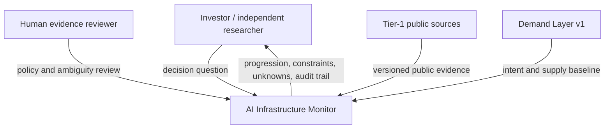
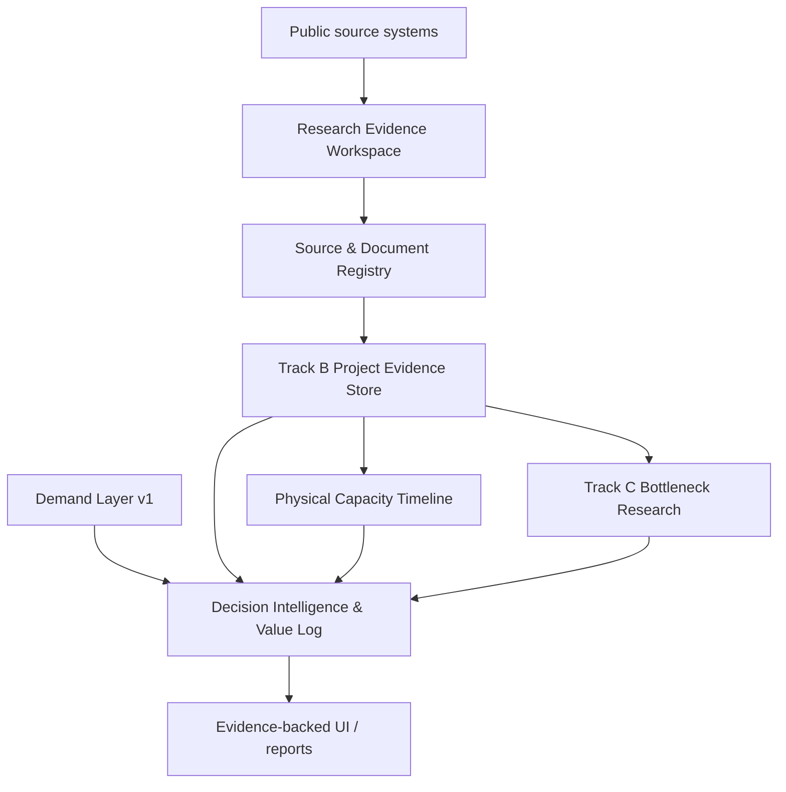
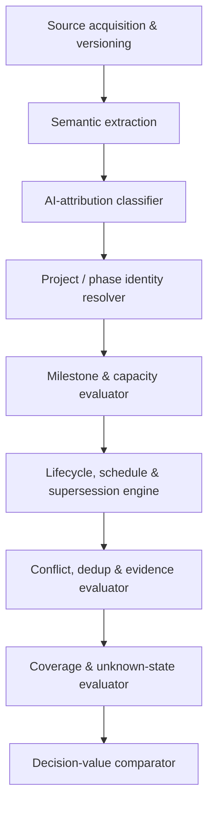

# AI Infrastructure Observability — C4 Architecture Roadmap

**Status:** `BLOCKED_PENDING_HUMAN_APPROVAL`
**Responsible human:** Jimmy Su
**Date:** 2026-08-27
**Specification:** [spec.md](./spec.md)
**Implementation authorization:** `NOT_GRANTED`

## 1. Baseline

- Repository: `jimisu/ai-infrastructure-monitor`
- Branch inspected: `main`
- HEAD and `origin/main`: `3de40afd9f54e875f91b1d3fe69ce7db83aebf08`
- Worktree at inspection: clean
- Existing active plan: `docs/exec-plans/active/evidence-backed-public-mvp-v0.1.md`
- Existing architecture supports immutable snapshots, version-aware canonical records,
  baseline/proposed-state verification, coverage separation, and deterministic downstream signals.
- Compatibility is not assumed: identity implementations are not fully unified, no generic
  qualitative canonical store exists, and there is no repository-wide architecture invariant suite.

This is a research architecture roadmap, not an approved execution plan. Any implementation must
receive a separate plan under `docs/exec-plans/active/`.

## 2. C1 — System Context



## 3. C2 — Container View



| Container | Responsibility | Boundary |
|---|---|---|
| Demand Layer v1 | Hyperscaler intent and TSMC confirmation | Existing authority; unchanged |
| Research Evidence Workspace | Discovery, translation, unresolved linkage, fixtures | Never production evidence |
| Source & Document Registry | Eligibility, immutable version, hash, retrieval and locator | Provenance trust boundary |
| Track B Project Evidence Store | Project/phase, lifecycle, conflicts, coverage and attribution | Later promotion approval required |
| Physical Capacity Timeline | Completion milestones, commissioning tranches, confirmed capacity, schedule risk and coverage-bound aggregates | Derived only from validated Track B facts; no raw-evidence recomputation |
| Track C Bottleneck Research | Constraint and exposure hypotheses | Blocked on Track B and value gate |
| Decision Intelligence & Value Log | Compare with baseline/manual research | Interpretation separate from facts |
| UI / reports | Present evidence, coverage and audit path together | No semantic recomputation |

## 4. C3 — Track B Components



| Component | Required audit output |
|---|---|
| Source verifier | eligibility, document identity/version, time, hash, locator |
| Claim extractor | quotation/locator, normalized claim, inference boundary |
| Identity resolver | aliases, parent/phase relation, match evidence, conflict |
| Unit normalizer | original/normalized unit, conversion, basis, precision |
| Milestone and capacity evaluator | reported time/range, completion kind, phase/tranche, original capacity basis, confirmed/planned/unquantified state |
| Evidence evaluator | level, independence, conflict, supersession, missing reason |
| Lifecycle and schedule engine | prior/new stage, transition evidence, official delay, schedule-at-risk reason, scope revision, effective date |
| Coverage evaluator | categorical availability, language, period, verification date |
| Decision comparator | baseline/new conclusion, confidence/action change, maintenance cost |

Every component fails closed with a reviewable reason. Model assistance remains advisory unless
deterministic policy or human-reviewed evidence establishes the result.

### Integration with the implemented baseline

Demand Layer v1 remains the authority for hyperscaler capital intent and TSMC supply confirmation.
Track B is a separate project/phase fact layer and must not encode project evidence as existing
numeric `MetricObservation` records or infer project MW from company CapEx. The layers join only in
Decision Intelligence after independent validation:

```text
Demand Layer v1: hyperscaler intent + TSMC confirmation
Track B: confirmed physical build + commissioned capacity timeline
Decision Intelligence: agreement, divergence, schedule risk and bottleneck research
```

R1 determines whether current acquisition, snapshot, document-version, provenance, coverage,
disposable proposed-state, HTTP and verification facilities can be reused. A new project/phase domain
store remains the expected boundary because the existing numeric observation contract cannot safely
represent campus/phase/tranche relations, qualitative lifecycle evidence, or non-additive capacity
states.

## 5. C4 — Code View Deferred

No schema, module, key, parser, provider, signal, or UI code design is approved here. After repository
compatibility, pilot feasibility, and product value are approved, a later execution plan may specify
code-level ports, deterministic identities, fixtures, tests, migration, promotion, and rollback.

## 6. Roadmap

| Stage | Duration | Output | Exit gate |
|---|---:|---|---|
| R0 — Positioning and specification decision | up to 1 week | Approved/narrowed product boundary, open-source landscape, reuse policy, evidence policy and issue map | Human approves differentiated research-only scope |
| R1 — Repository and reuse compatibility | 1–2 days | Reuse matrix for existing acquisition/provenance/coverage/proposed-state/verification contracts, project-store gap analysis, plus external license, schema and connector candidates | No semantic/legal incompatibility or new decision unresolved |
| R1M — Ten-day micro-pilot | 8 days after R1, separately gated | Two depth cases, a 5–8-project discovery pool, a non-production timeline prototype, selected negative cases and measured research effort | Micro-pilot verdict only; does not satisfy or replace R2 acceptance |
| R2 — Dual research pilot | 3–5 weeks | Five evidence-ledger depth cases plus a 15–25-project global timeline seed, capacity aggregates, schedule/coverage analysis and maintenance measurement | Track B technical verdict, timeline acceptance and value verdict |
| R3 — Domain and fixture design | 1–2 weeks | Deterministic identities, schemas, faithful fixtures, negative tests | Separate execution plan approved |
| R4 — Limited live ingestion | 2–4 weeks | Two or three repeatable Tier-1 paths in disposable state | Verification passes; no production write |
| R5 — Production proposal | about 1 week | Promotion/rollback plan and coverage-bound presentation proposal | Separate production authorization |
| R6 — Track C specification | 1–2 weeks | Bottleneck taxonomy and causal evidence contract | Track B stable and `VALUE_CONFIRMED` |
| R7 — Company-exposure research | 4–8 weeks | Five to ten profiles and financial-transmission feasibility verdict | Separate Track C decision |

Expected Track B usable version is 8–14 weeks. A first credible Track B + Track C research system is
14–24 weeks, followed by at least three to six months of calibration. These are planning ranges.

## 7. Gates and authorization

1. Approve/narrow this specification.
2. Approve/narrow the differentiated boundary and reuse-before-build policy.
3. Authorize repository-local and open-source reuse compatibility research.
4. Authorize the research-only pilot.
5. Accept/reject Track B technical and product-value verdicts.
6. Approve a separate implementation execution plan.
7. Separately authorize fixtures, live ingestion, production promotion, signals, UI, commit, push,
   PR, merge, and deployment as applicable.

No gate grants the next one automatically.

## 8. Verification and rollback

R0–R2 modify documentation and disposable research artifacts only. Future implementation must run
targeted identity/lifecycle/revision/conflict/deduplication tests, faithful fixture ingestion,
schema validation, downstream regression, `npm run verify:agent`, and `git diff --check`, plus compare
protected production paths before and after.

Demand Layer v1 is the rollback boundary. Track B must remain additive and removable without
rewriting existing canonical history or signals. Any incompatibility with current identity or
provenance stops work for human review.

## 9. Stop conditions

- primary evidence cannot support AI attribution for most cases;
- stable identity or deterministic deduplication cannot be achieved for at least four cases;
- verification requires private/paid/inaccessible data;
- the result becomes a manually scored news feed;
- the result primarily duplicates an existing facility map, initiative tracker, or open dataset;
- reuse candidates cannot preserve required license, provenance, semantic, or freshness boundaries;
- coverage caveats cannot prevent false completeness;
- acceptance criteria cannot be tested;
- a new semantic, production, migration, or authorization decision appears; or
- value is `VALUE_PLAUSIBLE_BUT_UNPROVEN` or `NO_INCREMENTAL_VALUE`.

## 10. Decision log

| Date | Decision | Owner | Rationale |
|---|---|---|---|
| 2026-08-27 | Preserve Demand Layer v1 and test sovereign AI + neocloud as Track B | Jimmy | Diversified demand should extend, not replace, the high-confidence baseline |
| 2026-08-27 | Use C4 for architecture and `spec.md` for requirements | Jimmy | Separate system boundaries, product semantics, roadmap and tasks |
| 2026-08-27 | AI drafts evidence policy; human approves ambiguity-sensitive rules | Jimmy | Gain research leverage without model-generated canonical facts |
| 2026-08-27 | Require product value in addition to technical feasibility | Jimmy | Do not maintain a correct system that fails to improve decisions |
| 2026-08-27 | Add open-source landscape and reuse-before-build gate to R0 | Jimmy | Avoid rebuilding maps/directories and require evidence-ledger differentiation |
| 2026-08-27 | Make the confirmed large-AI-capacity timeline the highest-priority Track B output | Jimmy W. Su | Connect capital intent to physically executable and commissioned capacity without converting CapEx into MW |
| 2026-08-27 | Join Demand Layer v1 and Track B only in Decision Intelligence | Jimmy W. Su | Preserve existing production semantics and make Track B additive and removable |
| 2026-08-27 | Use a dual R2 pilot: five depth cases plus 15–25 timeline projects | Jimmy W. Su | Test evidence quality and global aggregation value without claiming complete coverage |
| 2026-08-29 | Add a ten-working-day R1 + micro-pilot gate before full R2 | Jimmy W. Su | Test two real cases without weakening evidence rules or falsely claiming R2 completion |
| 2026-08-29 | Authorize full-R2 portfolio selection only | Jimmy W. Su | Permit a five-depth-case and 20-project candidate proposal with shallow coverage/feasibility screening; dossiers, pilot research and aggregation remain gated |
